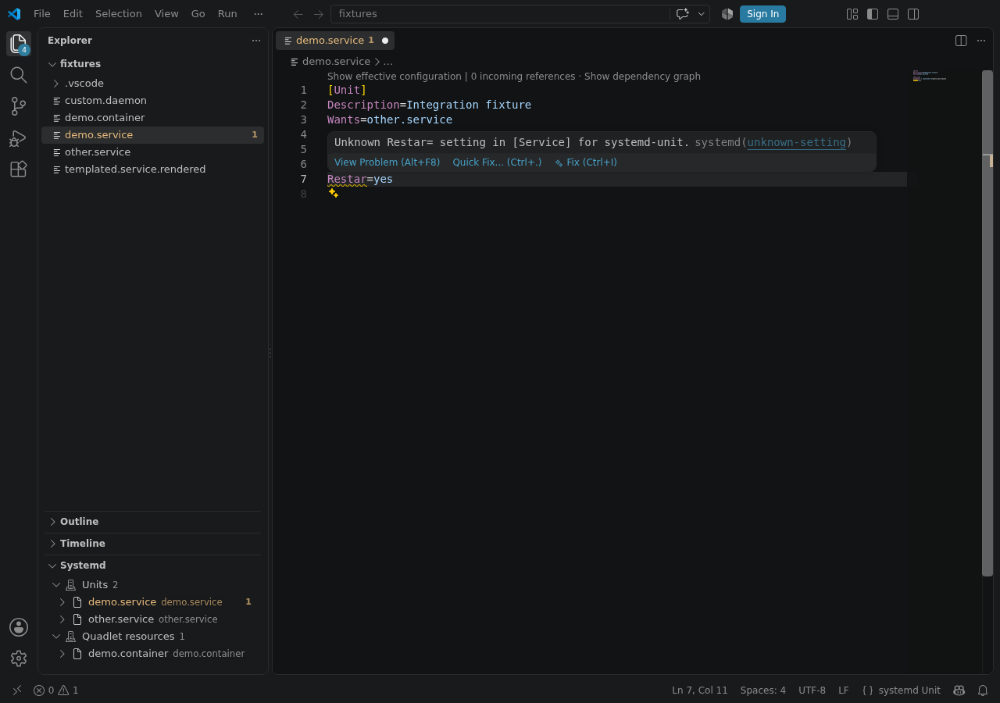

Syntax highlighting is theme-neutral and works before extension activation. The language server is
error tolerant, so editing help remains available while a file is incomplete.

## Language help

Completion suggests sections, directives, values, specifiers, and indexed unit or resource names
that are valid at the cursor. For settings whose upstream declaration gives a closed list of values,
such as service type or network link activation policy, completion offers those exact values and
validation rejects values outside the list. Open-ended settings still provide useful suggestions
without rejecting valid custom forms. Hover describes the selected directive and links to its
official manual. Signature help presents the expected value shape. Document and workspace symbols,
folding, selection ranges, semantic tokens, and specifier inlay hints use the parsed configuration
rather than text-only guesses.

Path-valued settings complete files and directories relative to the configuration file. The same
behavior works in local, remote, and virtual browser workspaces because reads go through VS Code's
filesystem API; requests are restricted to workspace-owned paths, 500 directory entries, and 2 MiB
files. Unit files and Quadlet use systemd `%` specifiers, while mkosi completion and inlay hints use
mkosi's distinct setting, directory, and subimage specifiers.

The bundled registry is generated from pinned systemd, Podman, and mkosi source revisions. Normal
language help does not require a network request or a host executable. Its parser is additionally
checked against successful fixtures from those same pinned upstream trees, including mkosi's
indented multiline values and conditional sections. Representative unit and networkd fuzz fixtures
from systemd v250, v252, v254, v256, v258, v260, and v261 are additionally analyzed against their
matching target release, so version-aware diagnostics are exercised on historical source rather than
synthetic examples alone.

Quadlet setting types and repeat behavior come from Podman's Go converter lookups, while defaults
and finite or open-ended choices come from the matching version of Podman's manual. Hover therefore
shows the correct Podman availability and constraints, and completion can distinguish a closed
choice such as `ExitCodePropagation=all|any|none` from extensible values such as network drivers.
Basic generator fixtures for every Quadlet type are checked across every non-prerelease Podman
release from 4.4 onward, alongside current templates, resource references, service-name overrides,
and merged configurations.

The generated registry is stored as a deterministic tuple schema and hydrated into typed definitions
at startup. This avoids duplicating descriptive field names into every desktop and browser bundle
while preserving identical stable and preview behavior.

udev rules receive key, attribute, operator, and value completion. Hardware database files receive
match-prefix and property completion, including typed values for systemd's shipped properties and
dynamic keyboard and evdev property families. Their record separators, comments, duplicate fields,
and required property relationships are validated against the pinned upstream parsers while custom
vendor properties remain supported.

## File skeletons

At the start of an empty file, type a snippet prefix such as `service-unit`, `network-static`,
`config-nspawn`, `quadlet-container`, or `mkosi-image`. The extension includes complete starting
points for every unit type that systemd allows developers to configure in a file; common networkd,
DNS-SD, DNS delegation, daemon, container, repart, and sysupdate configurations; every current
Quadlet type; and common mkosi outputs. Placeholder choices cover details such as service type,
network policy, user or system installation target, image format, and bootloader.

There is intentionally no `.scope` file skeleton: systemd creates scope units programmatically and
does not load them from unit configuration files. Existing scope units remain recognized for
navigation and inspection.

## Diagnostics and quick fixes

Built-in diagnostics cover unknown and misplaced sections or directives, malformed values, missing
required sections and settings, version availability, deprecations, and unit ordering cycles. For
Quadlet, this includes the inputs required by Podman's converter, such as `Image=`, `Yaml=`,
`Artifact=`, and build tags and contexts. Related locations connect a cycle or cross-file reference
to the other indexed configuration involved. Close directive misspellings offer conservative quick
fixes.

## Navigation and rename

Go to definition, references, document highlights, and rename operate on parsed unit and resource
references. Rename is intentionally textual and limited to references the language server can
identify safely; it never renames a host unit or writes outside the workspace.

## Formatting

Run **Format Document** from the Command Palette or editor menu. Formatting normalizes safe spacing
and indentation while preserving comments, directive order, quoting, and template expressions.
