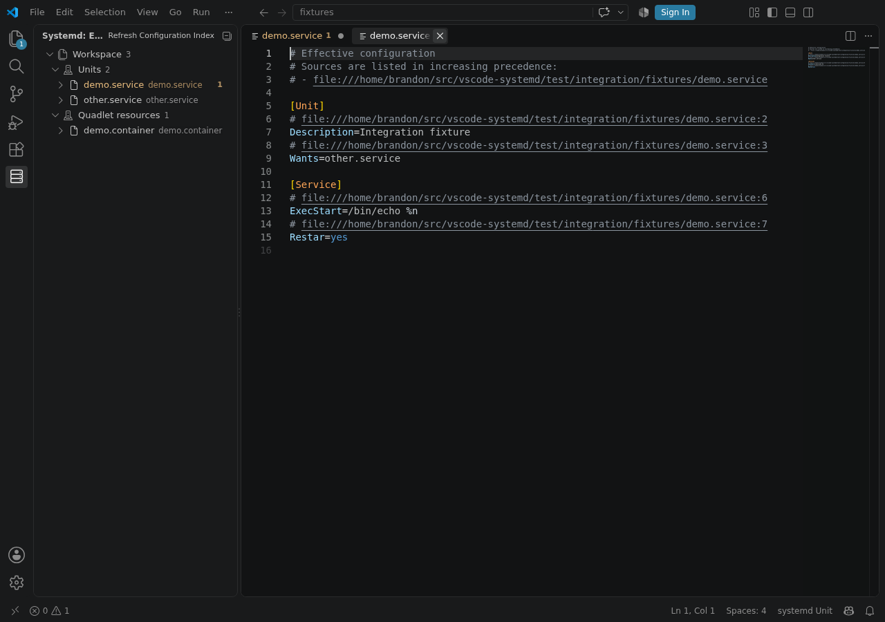

The index powers cross-file completion, navigation, the systemd Explorer, merged units, and
dependency graphs.

Select the **systemd** server icon in the Activity Bar to open the Explorer. Workspace files are
shown first. Automatic workspace discovery respects VS Code `files.exclude` and nested `.gitignore`
files. Opened files and files reached through explicit mkosi includes remain available. Set
`systemd.index.useIgnoreFiles` to `false` only when an ignored generated tree should be indexed.
Indexed Linux or WSL files are grouped under **Host**.

On trusted Linux hosts, it can also read standard systemd paths. Set `systemd.index.scope` to
`workspace` to skip them. Host files are read-only.

References without a local or indexed host file are labeled `not indexed`.

**Show Effective Configuration** applies drop-ins, precedence, resets, templates, aliases, and
masks. Each result links to its source.

**Show Dependency Graph** shows relationships found in files, not running services.
