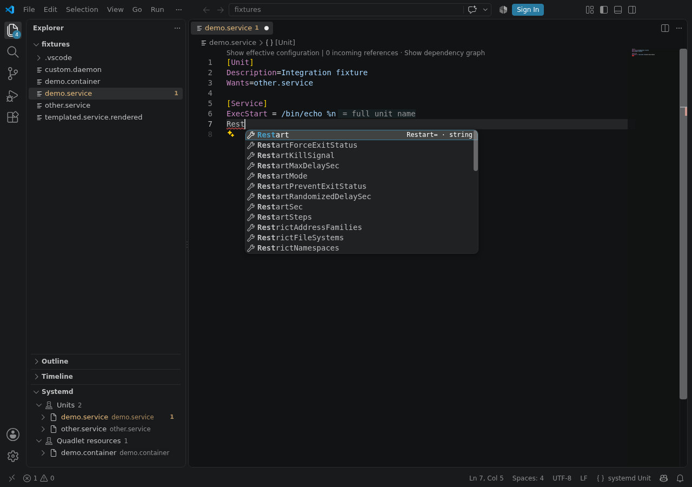

Highlight, complete, check, navigate, and format systemd, Quadlet, and mkosi files.

```systemd
[Unit]
Description=Example API
After=network-online.target

[Service]
ExecStart=/usr/local/bin/example-api
Restart=on-failure

[Install]
WantedBy=multi-user.target
```



The extension works locally, remotely, and in the browser. It does not manage services or request
root access.

[Install a test build](./getting-started/) or see [recognized files](./recognized-files/).
